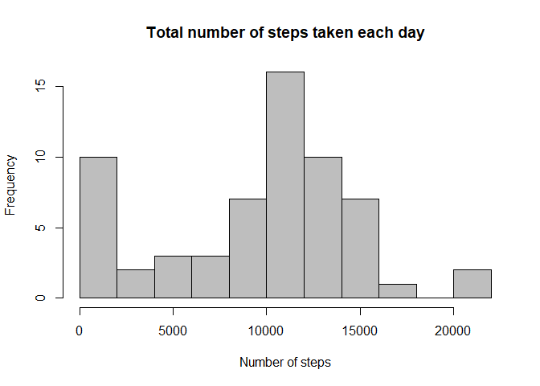
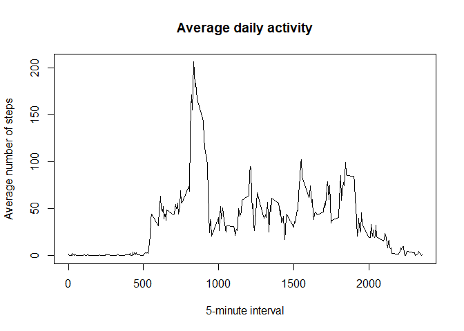
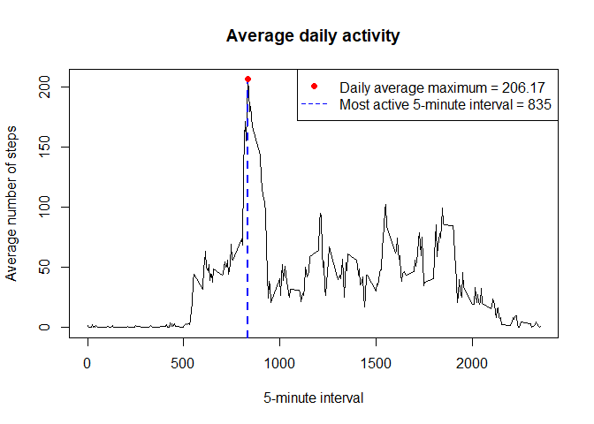
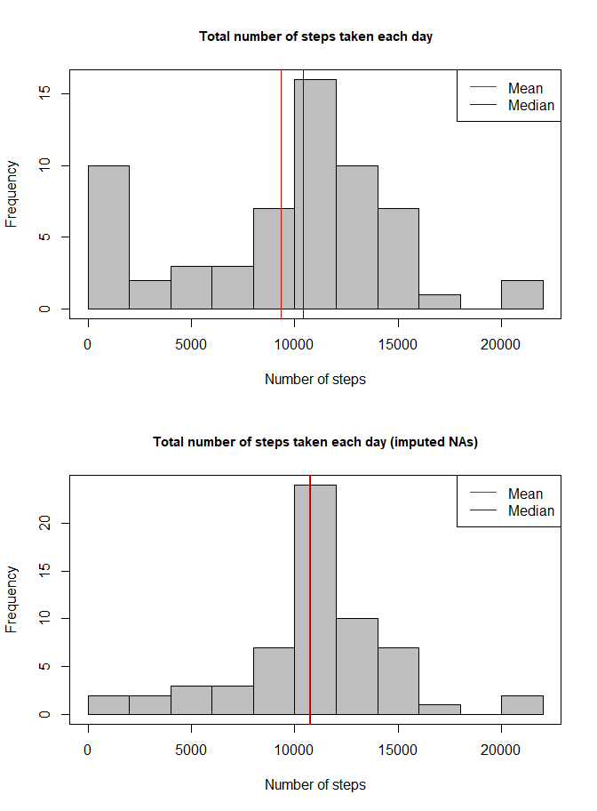
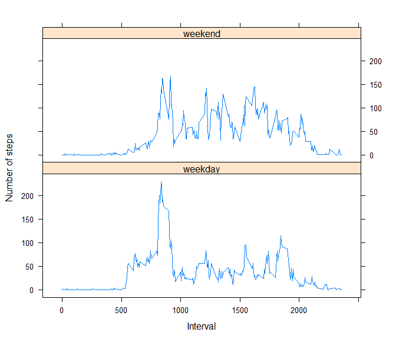

## Loading and preprocessing the data

```r
unzip(zipfile = "activity.zip")
activity <- read.csv(file = "activity.csv", header = TRUE)
activity$date <- as.Date(activity$date)
#activity$interval <- as.factor(activity$interval)
```

## What is mean total number of steps taken per day?

1. Calculate the total number of steps taken per day


```r
steps_daily <- with(activity, tapply(steps, date, sum, na.rm = TRUE))
steps_daily <- data.frame(date = names(steps_daily), total_steps = unname(steps_daily))
print(steps_daily)
```

```
##          date total_steps
## 1  2012-10-01           0
## 2  2012-10-02         126
## 3  2012-10-03       11352
## 4  2012-10-04       12116
## 5  2012-10-05       13294
## 6  2012-10-06       15420
## 7  2012-10-07       11015
## 8  2012-10-08           0
## 9  2012-10-09       12811
## 10 2012-10-10        9900
## 11 2012-10-11       10304
## 12 2012-10-12       17382
## 13 2012-10-13       12426
## 14 2012-10-14       15098
## 15 2012-10-15       10139
## 16 2012-10-16       15084
## 17 2012-10-17       13452
## 18 2012-10-18       10056
## 19 2012-10-19       11829
## 20 2012-10-20       10395
## 21 2012-10-21        8821
## 22 2012-10-22       13460
## 23 2012-10-23        8918
## 24 2012-10-24        8355
## 25 2012-10-25        2492
## 26 2012-10-26        6778
## 27 2012-10-27       10119
## 28 2012-10-28       11458
## 29 2012-10-29        5018
## 30 2012-10-30        9819
## 31 2012-10-31       15414
## 32 2012-11-01           0
## 33 2012-11-02       10600
## 34 2012-11-03       10571
## 35 2012-11-04           0
## 36 2012-11-05       10439
## 37 2012-11-06        8334
## 38 2012-11-07       12883
## 39 2012-11-08        3219
## 40 2012-11-09           0
## 41 2012-11-10           0
## 42 2012-11-11       12608
## 43 2012-11-12       10765
## 44 2012-11-13        7336
## 45 2012-11-14           0
## 46 2012-11-15          41
## 47 2012-11-16        5441
## 48 2012-11-17       14339
## 49 2012-11-18       15110
## 50 2012-11-19        8841
## 51 2012-11-20        4472
## 52 2012-11-21       12787
## 53 2012-11-22       20427
## 54 2012-11-23       21194
## 55 2012-11-24       14478
## 56 2012-11-25       11834
## 57 2012-11-26       11162
## 58 2012-11-27       13646
## 59 2012-11-28       10183
## 60 2012-11-29        7047
## 61 2012-11-30           0
```

2. Make a histogram of the total number of steps taken each day


```r
hist(steps_daily$total_steps, breaks = 15, col = "grey", xlab = "Number of steps",
     main = "Total number of steps taken each day")
```

<!-- -->

3. Calculate and report the mean and median of the total number of steps taken per day


```r
steps_stats <- data.frame(mean = mean(steps_daily$total_steps, na.rm = TRUE),
                          median = median(steps_daily$total_steps, na,na.rm = TRUE))
library(kableExtra)
stats_table <- kable(steps_stats, caption = "Summary statistics of total number of steps",
                     table.attr = "style='width:28%;'", col.names = c("Mean", "Median"))
kable_classic(stats_table, font_size = 17)
```

<table style='width:28%; font-size: 17px; font-family: "Arial Narrow", "Source Sans Pro", sans-serif; margin-left: auto; margin-right: auto;' class=" lightable-classic">
<caption style="font-size: initial !important;">Summary statistics of total number of steps</caption>
 <thead>
  <tr>
   <th style="text-align:right;"> Mean </th>
   <th style="text-align:right;"> Median </th>
  </tr>
 </thead>
<tbody>
  <tr>
   <td style="text-align:right;"> 9354.23 </td>
   <td style="text-align:right;"> 10395 </td>
  </tr>
</tbody>
</table>

## What is the average daily activity pattern?

1. Make a time series plot (i.e. type = "l") of the 5-minute interval (x-axis) and the average number of steps taken, averaged across all days (y-axis)


```r
steps_interval <- with(activity, tapply(steps, interval, mean, na.rm = TRUE))
steps_interval <- data.frame(interval = as.numeric(names(steps_interval)),
                             mean_steps = unname(steps_interval))
with(steps_interval, plot(mean_steps ~ interval, type = "l", xlab = "5-minute interval",
                          ylab = "Average number of steps",
                          main = "Average daily activity"))
```

<!-- -->

2. Which 5-minute interval, on average across all the days in the dataset, contains the maximum number of steps?


```r
with(steps_interval, plot(mean_steps ~ interval, type = "l", xlab = "5-minute interval",
                          ylab = "Average number of steps",
                          main = "Average daily activity"))
max_steps <- which.max(steps_interval$mean_steps)
abline(v = steps_interval[max_steps,"interval"], col = "blue", lwd = 2, lty = 2)
points(steps_interval[max_steps,], pch = 19, col = "red")
legend("topright", legend = c(paste("Daily average maximum =",
                                  round(steps_interval[max_steps,"mean_steps"],2)),
                              paste("Most active 5-minute interval =",
                                    steps_interval[max_steps,"interval"])),
       pch = c(19, NA), lty = c(NA, 2), col = c("red", "blue"))
```

<!-- -->

Interval "**835**" contains the maximum average number of steps, which is equal to **206.17**.

## Imputing missing values

1. Calculate and report the total number of missing values in the dataset (i.e. the total number of rows with NAs)


```r
missing <- sum(is.na(activity$steps))
```
The total number of missing values in the dataset is **2304**.

2. Devise a strategy for filling in all of the missing values in the dataset. The strategy does not need to be sophisticated. For example, you could use the mean/median for that day, or the mean for that 5-minute interval, etc.

```r
steps_NA <- which(is.na(activity$steps))
steps_interval_new <- with(activity, tapply(steps, interval, mean, na.rm = TRUE))
activity_imputed <- activity
activity_imputed[steps_NA,"steps"] <- steps_interval_new[as.character(activity_imputed[steps_NA,"interval"])]
```

3. Create a new dataset that is equal to the original dataset but with the missing data filled in.

`activity_imputed` is the new dataset with the imputed missing values. As confirmed by the code below, there are no missing values
```{}
sum(is.na(activity_imputed))
```

4. Make a histogram of the total number of steps taken each day and calculate and report the mean and median total number of steps taken per day. Do these values differ from the estimates from the first part of the assignment? What is the impact of imputing missing data on the estimates of the total daily number of steps?


```r
par(mfrow = c(2,1), cex.main = 0.95)

steps_daily <- with(activity, tapply(steps, date, sum, na.rm = TRUE))
steps_daily <- data.frame(date = names(steps_daily), total_steps = unname(steps_daily))

steps_daily_imputed <- with(activity_imputed, tapply(steps, date, sum, na.rm = TRUE))
steps_daily_imputed <- data.frame(date = names(steps_daily_imputed), total_steps = unname(steps_daily_imputed))

hist(steps_daily$total_steps, breaks = 15, col = "grey", xlab = "Number of steps", main = "Total number of steps taken each day")
box()
abline(v = mean(steps_daily$total_steps), col = "red")
abline(v = median(steps_daily$total_steps), col = "blue")
legend("topright", legend = c("Mean", "Median"), lty = c(1, 1), col = c("red", "blue"))

hist(steps_daily_imputed$total_steps, breaks = 15, col = "grey", xlab = "Number of steps", main = "Total number of steps taken each day (imputed NAs)")
box()
abline(v = mean(steps_daily_imputed$total_steps), col = "red", lwd = 2)
abline(v = median(steps_daily_imputed$total_steps), col = "blue")
legend("topright", legend = c("Mean", "Median"), lty = c(1, 1), col = c("red", "blue"))
```

<!-- -->


```r
stats <- apply(data.frame(original = steps_daily$total_steps, imputed = steps_daily_imputed$total_steps), 2, FUN = summary)
stats <- stats[c("Mean", "Median"),]
stats_table <- kable(stats, caption = "Comparison of summary statistics for original and imputed dataset", table.attr = "style='width:28%;'", col.names = c("Original", "Imputed"))
kable_classic(stats_table, font_size = 17)
```

<table style='width:28%; font-size: 17px; font-family: "Arial Narrow", "Source Sans Pro", sans-serif; margin-left: auto; margin-right: auto;' class=" lightable-classic">
<caption style="font-size: initial !important;">Comparison of summary statistics for original and imputed dataset</caption>
 <thead>
  <tr>
   <th style="text-align:left;">   </th>
   <th style="text-align:right;"> Original </th>
   <th style="text-align:right;"> Imputed </th>
  </tr>
 </thead>
<tbody>
  <tr>
   <td style="text-align:left;"> Mean </td>
   <td style="text-align:right;"> 9354.23 </td>
   <td style="text-align:right;"> 10766.19 </td>
  </tr>
  <tr>
   <td style="text-align:left;"> Median </td>
   <td style="text-align:right;"> 10395.00 </td>
   <td style="text-align:right;"> 10766.19 </td>
  </tr>
</tbody>
</table>

## Are there differences in activity patterns between weekdays and weekends?

1. Create a new factor variable in the dataset with two levels – “weekday” and “weekend” indicating whether a given date is a weekday or weekend day.


```r
weekday_f <- function(m){
    ifelse(weekdays(m) %in% c("Monday", "Tuesday", "Wednesday", "Thursday", "Friday"), "weekday", "weekend")
}

activity_imputed$weekday <- sapply(activity_imputed[,"date"], weekday_f)
activity_imputed$weekday <- as.factor(activity_imputed$weekday)
```

2. Make a panel plot containing a time series plot (i.e. type = "l") of the 5-minute interval (x-axis) and the average number of steps taken, averaged across all weekday days or weekend days (y-axis). See the README file in the GitHub repository to see an example of what this plot should look like using simulated data.


```r
panel_plot <- as.data.frame(with(activity_imputed, tapply(steps, list(interval, weekday), mean, na.rm = T)))
panel_plot$interval <- as.numeric(row.names(panel_plot))
library(tidyverse)
```

```
## -- Attaching packages ----------------------------------------------------- tidyverse 1.3.0 --
```

```
## v ggplot2 3.3.0     v purrr   0.3.3
## v tibble  3.0.0     v dplyr   0.8.5
## v tidyr   1.0.2     v stringr 1.4.0
## v readr   1.3.1     v forcats 0.5.0
```

```
## -- Conflicts -------------------------------------------------------- tidyverse_conflicts() --
## x dplyr::filter()     masks stats::filter()
## x dplyr::group_rows() masks kableExtra::group_rows()
## x dplyr::lag()        masks stats::lag()
```

```r
panel_plot <- as_tibble(panel_plot)
panel_plot_long <- pivot_longer(data = panel_plot, cols = -interval, names_to = "weekday", values_to = "mean_steps")

library(lattice)
xyplot(mean_steps ~ interval | weekday, data = panel_plot_long, layout = c(1,2), type = "l", xlab = "Interval", ylab = "Number of steps", scales = )
```

<!-- -->
